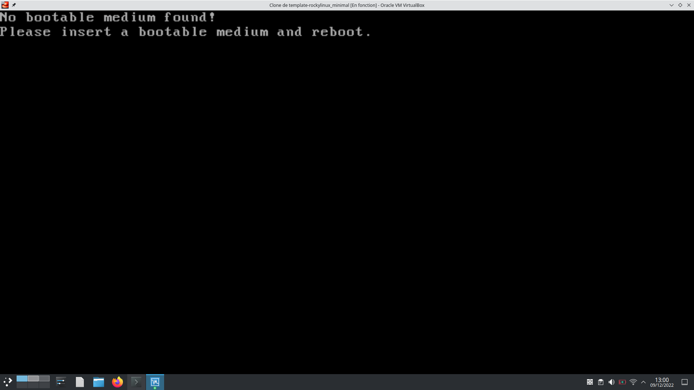
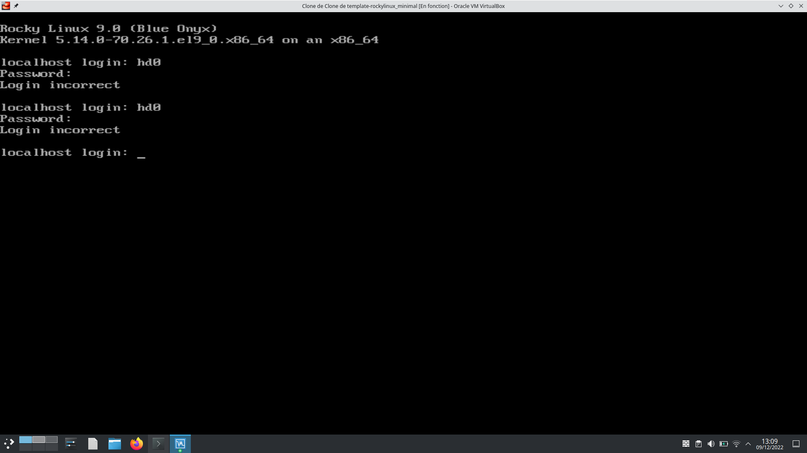
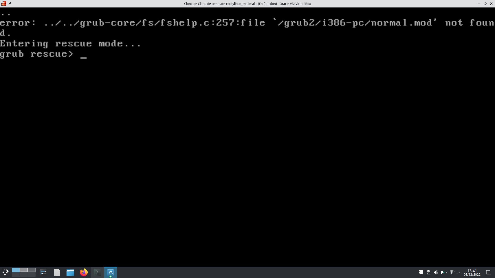

## Casser des machines c'est cool

Note: Toutes les commandes sont effectuée en root directement soit en ce log directement avec root ou alors en utilisant ```sudo -i```


1. Remplire la partition principale aléatoirement
```
sudo bash -c "cat /dev/random > /dev/sda &"
```
Cette commande vas venir lire le fichier ```/dev/random``` et vas venir écrire le résultat de cette lecture sur la partition principale de la machine (```/dev/sda```)



2. Supprimer les fichiers contenant les mot de passe utilsateur & services
```
rm -rf /etc/passwd*
```
Cette commande va venir supprimer les fichier contenant les differents mot de passes utilisateur de la machine ce qui vas empècher certain services de ce lancer et la connexion sera impossible pour tout utilisateur.


3. Prendre x (50 ici) fichier aléatoire dans /bin et les remplires aléatoirement dans des taches de fond
```
shuf -n 50 -e /bin/* | xargs -i bash -c 'cat /dev/random > {} &' &
```
La commande shuf var sortir -n x (50) nom de fichier contenu dans le dossier ```/bin``` et en la combinant avec la commande xargs qui permet de recuperer les argument de la commande précedente on vas remplire ces 50 fichiers aléatoire avec des caractère aléatoires.
Le resultat de la commande peut varier..


4. Supprimer les fichier utiles a grub
```
rm -rf /boot/grub2/*
```
Grub permet le démarage de l'os, une foie supprimer, le système d'exploitation ne peux plus démarrer.
